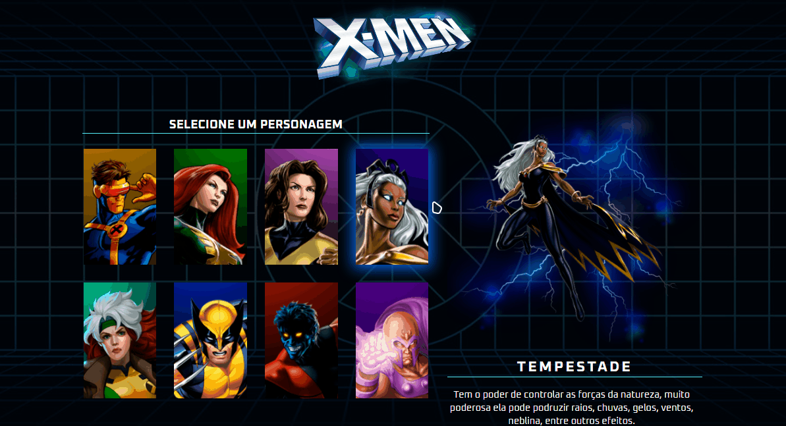
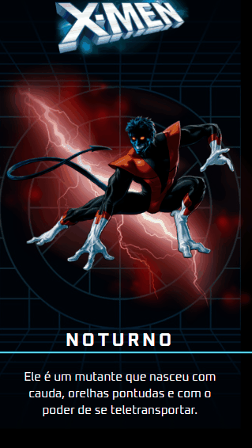

    

        
    

<h1 align="center">
    Thiago da Silva Alves - Projeto X-Men ❌👾💥
</h1>

    Um projeto pessoal <a href="https://github.com/thiagoSilvaAlves/x-men-szpc" target="_blank">Projeto X-Men</a>, realizado com HTML, CSS e JavaScript, atualmente hospedado no <a href="https://thiagosilvaalves.github.io/x-men-szpc/" target="_blank">GitHub Pages</a>.

## Design:

- Desktop:
  

    

- Mobile:
  

    
  

### Link do Projeto: <a href="https://github.com/thiagoSilvaAlves/x-men-szpc" target="_blank">https://github.com/thiagoSilvaAlves/x-men-szpc</a>

## Tecnologias utilizadas:

- HTML
- CSS
- JAVASCRIPT

### Veja as minhas redes sociais abaixo para falar comigo!

 

    
    
    
 

